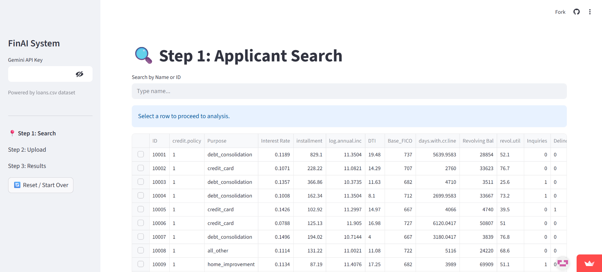

# The AI-Powered Credit Risk Determination

 
## WebSite

**https://credit-risk-detection-um-hackathon.streamlit.app**


## The Problem

Traditional credit scoring models (like FICO) are powerful but often fail to consider the full context of an applicant's financial situation. A low score might be assigned due to temporary setbacks (e.g., a medical emergency, unemployment between high-paying jobs) that are not reflective of the applicant's true ability to repay.

This system addresses that gap by:
1.  **Analyzing Unstructured Data:** It ingests emails, letters, chat logs, and other documents to find hidden evidence.
2.  **Refining Scores:** It uses AI-driven insights to adjust the baseline FICO score, providing a more holistic "Refined Score."
3.  **Providing Explainability:** It generates clear, human-readable explanations for its decisions, ensuring transparency.

## How It Works

The application follows a three-step workflow:

1.  **Search & Select:** The user searches for an applicant from a database (simulated in `loans.csv`).
2.  **Analyze & Interview:** The user reviews existing documents, uploads new evidence, and can even "interview" an AI-simulated version of the applicant to gather more information.
3.  **Review Results:** The system sends all the evidence to the Gemini API, which returns a structured JSON object containing:
    *   **Findings:** Specific pieces of evidence categorized as positive, negative, or critical.
    *   **Score Modifiers:** Point adjustments based on the severity of the findings.
    *   **Summary:** A plain-English explanation of the final recommendation.


## Running Locally

Follow these steps to set up and run the project in your own environment.

### 1. Python Enviroment and Gemini API
*   `Python 3.13+` and `pip` installed on your system.
*   A Google Gemini `API Key`. You can get one from [Google AI Studio](https://aistudio.google.com/app/apikey).

### 2. Fork / Clone the Repository
Open your terminal and run the following command to clone the project:
```bash
git clone https://github.com/your-username/Credit-Risk-Detection.git
cd Credit-Risk-Detection
```

### 3. Install Dependencies
Install all the required Python packages using the `requirements.txt` file:
```bash
pip install -r requirements.txt
```

### 4. Set Up Your API Key
The application needs your Gemini API key to function.
1.  Run the app for the first time (see step 5).
2.  The application will open in your web browser.
3.  In the sidebar on the left, you will see a text input field labeled **"Gemini API Key"**.
4.  Paste your secret API key there.

### 5. Run the Application
Once the dependencies are installed, you can run the Streamlit app with the following command:
```bash
streamlit run app.py
```
The application should automatically open in a new tab in your default web browser.

